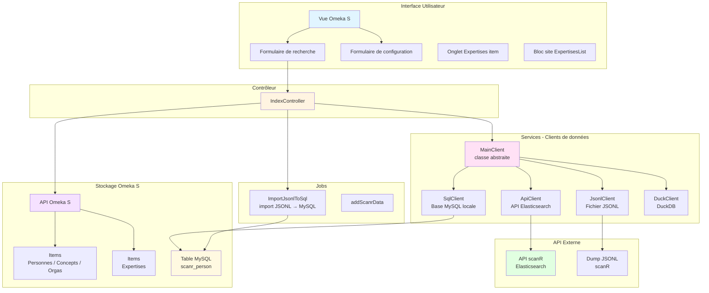
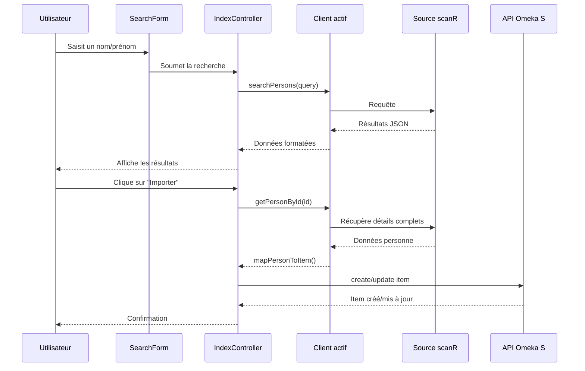
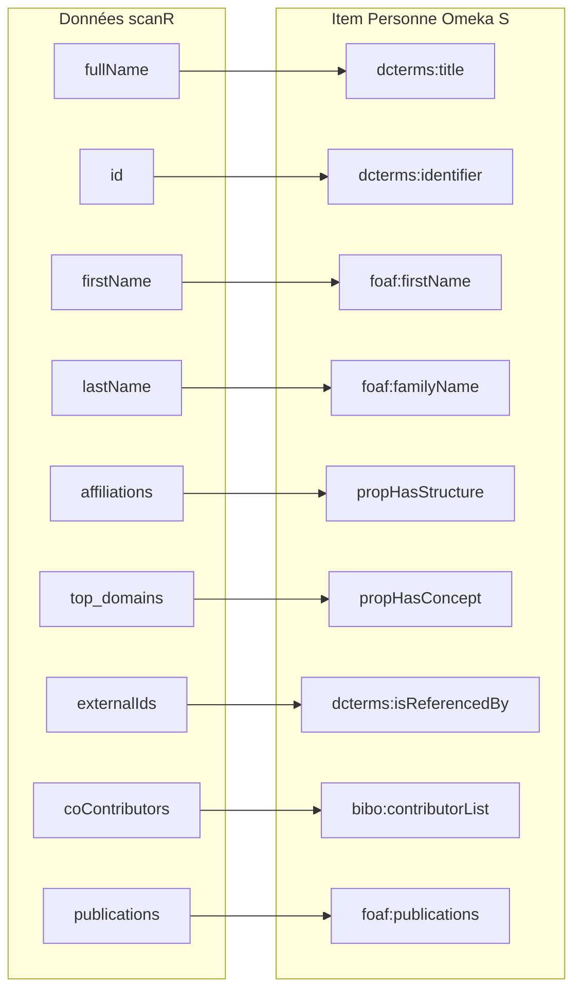

# Omeka-S-module-Scanr

Module Omeka S pour interroger l'API Elasticsearch de scanR, importer les données de personnes et gérer les expertises associées.

## Description

Ce module permet d'interroger la plateforme scanR du Ministère de l'Enseignement Supérieur et de la Recherche française pour rechercher et importer des informations sur des chercheurs directement dans Omeka S. Il offre également un système de gestion des expertises par mots-clés avec contrôle des droits par rôle.

scanR recense les acteurs de la recherche et de l'innovation en France : chercheurs, affiliations, domaines de recherche, publications et distinctions.

## Architecture

### Composants du module

### Sélection automatique du client de données

Le module sélectionne automatiquement la source de données la plus pertinente :

1. **SqlClient** (prioritaire) — base MySQL locale, recherche FULLTEXT rapide
2. **ApiClient** — API Elasticsearch scanR officielle, données à jour
3. **JsonlClient** — fallback PHP pur sur le fichier JSONL téléchargé

### Flux d'import d'une personne

## Fonctionnalités

### Recherche et import de personnes
- **Recherche multi-sources** : SQL local, API scanR ou fichier JSONL selon disponibilité
- **Affichage des résultats** : nom, affiliations, domaines, score de pertinence
- **Import dans Omeka S** : création d'items avec métadonnées complètes
- **Association à un item existant** : mise à jour d'un item Omeka existant avec les données scanR
- **Import JSONL en base** : job d'arrière-plan pour charger le dump scanR en MySQL

### Gestion des expertises
- **Onglet Expertises** sur chaque item personne : affiche les mots-clés de la personne avec les notes d'expertise
- **Vote d'expertise** : noter positivement ou négativement un mot-clé pour une personne
- **Ajout de mots-clés** : recherche par autocomplétion et ajout de nouveaux concepts
- **Contrôle des droits par rôle** (voir section Droits ci-dessous)
- **Bloc site ExpertisesList** : affiche la liste des expertises sur une page publique

### Configuration
- URL de l'API scanR et authentification (login/mot de passe)
- Chemin du fichier JSONL local
- Correspondances de classes et propriétés Omeka (personnes, structures, concepts)
- Template et item set par défaut pour les personnes importées

## Droits et rôles

La gestion des expertises respecte les rôles Omeka S :

| Rôle | Droits expertises |
|------|------------------|
| `global_admin` / `site_admin` | Toutes les expertises |
| `reviewer` | Personnes des laboratoires dont il est responsable (paramètre `scanr_labos_admin`) |
| `author` | Uniquement sa propre fiche (correspondance email CAS) |
| `researcher` | Lecture seule |

## Installation

1. Téléchargez ou clonez ce module dans le répertoire `modules` de votre installation Omeka S
2. Renommez le dossier en `Scanr` si nécessaire
3. Dans le répertoire `Scanr`, exécutez : `composer install --no-dev`
4. Dans l'interface d'administration Omeka S, allez dans **Modules**
5. Trouvez "Scanr" et cliquez sur **Installer**

### Dépendances requises
- Module **Common** (pour les éléments de formulaire OptionalPropertySelect, etc.)
- Extension PHP **cURL** activée

## Configuration

Après l'installation, cliquez sur **Configurer** à côté du module Scanr.

### Paramètres disponibles

| Paramètre | Description |
|-----------|-------------|
| `scanr_json_path` | Chemin vers le fichier JSONL scanR |
| `scanr_api_url` | URL de l'API Elasticsearch (défaut : `https://scanr-api.enseignementsup-recherche.gouv.fr`) |
| `scanr_api_username` | Identifiant API scanR |
| `scanr_api_password` | Mot de passe API scanR |
| `scanr_properties_fullName` | Propriété pour retrouver une personne (ex: `foaf:name`) |
| `scanr_class_person` | Classe Omeka des personnes (ex: `foaf:Person`) |
| `scanr_template_person` | Template Omeka pour les personnes |
| `scanr_itemset_person` | Item set Omeka pour les personnes importées |
| `scanr_class_structure` | Classe Omeka des structures/organisations |
| `scanr_properties_hasStructure` | Propriété liant personne → structure |
| `scanr_properties_hasConcept` | Propriété liant personne → concept/domaine |
| `scanr_properties_CasAccount` | Propriété stockant l'email CAS (pour rôle `author`) |
| `scanr_properties_isInLabos` | Propriété indiquant le labo d'une personne (pour rôle `reviewer`) |

### Paramètres utilisateur

Chaque utilisateur avec le rôle `reviewer` peut configurer dans ses préférences :
- `scanr_labos_admin` : liste des laboratoires dont il est responsable

## Utilisation

### Rechercher et importer des personnes

1. Dans le menu d'administration, cliquez sur **Scanr**
2. Entrez un nom, prénom ou affiliation dans le champ de recherche
3. Cliquez sur **Rechercher**
4. Sur chaque résultat :
   - **Importer** : crée un nouvel item Omeka S
   - **Associer** : met à jour un item existant avec les données scanR

### Importer le dump JSONL en base MySQL

1. Téléchargez le fichier JSONL depuis [scanR docs](https://scanr.enseignementsup-recherche.gouv.fr/docs/overview) et placez-le dans le répertoire `data/` du module
2. Configurez le chemin dans les paramètres du module
3. Dans l'administration, déclenchez l'action **Import JSONL → SQL**
4. Un job s'exécute en arrière-plan (consultez **Tâches** pour suivre la progression)

### Gérer les expertises d'une personne

1. Ouvrez un item personne dans l'administration Omeka S
2. Cliquez sur l'onglet **Expertises**
3. Les mots-clés de la personne (propriété `hasConcept`) s'affichent avec les votes
4. Votez positivement (+) ou négativement (−) selon votre niveau d'autorisation
5. Ajoutez de nouveaux mots-clés via le champ d'autocomplétion

### Bloc site ExpertisesList

1. Éditez une page de site Omeka S
2. Ajoutez le bloc **Expertises Scanr**
3. Définissez une requête pour filtrer les personnes à afficher
4. Ajoutez un titre optionnel

## Structure des données

### Mapping scanR → Omeka S

Les liens `propHasStructure` et `propHasConcept` sont configurables et peuvent utiliser des **value annotations** pour stocker des métadonnées supplémentaires (rang, dates de début/fin).

### Items créés automatiquement

| Type | Classe | Créé lors de |
|------|--------|-------------|
| Personne | configurée (`foaf:Person`) | Import / association |
| Concept/domaine | `skos:Concept` | Import des domaines |
| Organisation | configurée (`foaf:Organization`) | Import des affiliations |
| Expertise | `valo:Expertises_all` | Vote d'expertise |

### Structure d'un item Expertise

Un item Expertise relie une personne à un concept avec une note :

| Propriété | Contenu |
|-----------|---------|
| `dcterms:title` | Titre auto-généré : "Expertise - [concept] = [note] - pour [personne] fait par [auteur] le [date]" |
| `valo:expertise` | Lien vers l'item concept |
| `dcterms:source` | Lien vers l'item personne |
| `curation:rank` | Note numérique (positif ou négatif) |

## API REST (actions AJAX)

Le contrôleur expose l'action `expertise-ajax` pour les interactions en JavaScript :

| Action | Méthode | Description |
|--------|---------|-------------|
| `isAllowed` | GET | Vérifie si l'utilisateur courant peut modifier les expertises d'un item |
| `load` | GET | Charge les mots-clés et expertises d'un item personne |
| `create` | POST | Crée une nouvelle expertise |
| `update` | POST | Modifie la note d'une expertise existante |
| `addKeyword` | POST | Ajoute un nouveau concept à une personne |
| `delete` | POST | Supprime une expertise |

## API scanR

- Site web : https://scanr.enseignementsup-recherche.gouv.fr
- Documentation API : https://scanr-api.enseignementsup-recherche.gouv.fr
- Dump JSONL : https://scanr.enseignementsup-recherche.gouv.fr/docs/overview

## Exigences

- Omeka S 4.1.0 ou supérieur
- PHP 7.4 ou supérieur
- Extension PHP cURL activée
- Module **Common** installé
- MySQL 5.7+ ou MariaDB 10.3+ (pour l'index FULLTEXT)

## Auteur

Samuel Szoniecky, Laboratoire Paragraphe

## Licence

GPL-3.0

## Support

Pour signaler des bugs ou demander des fonctionnalités : https://github.com/samszo/Omeka-S-module-Scanr/issues
