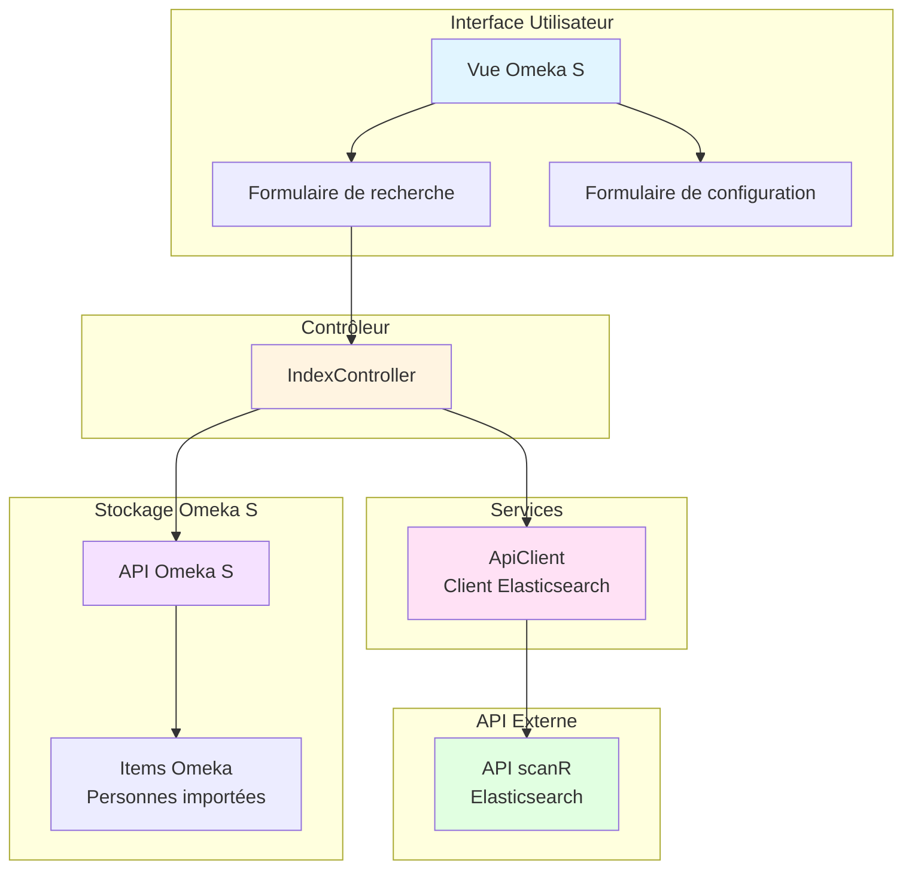
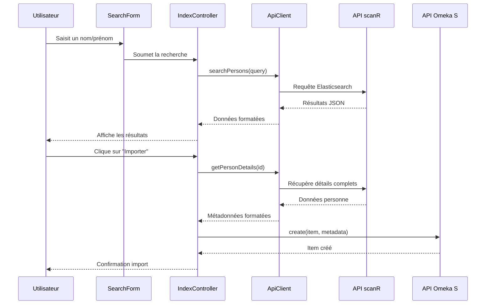
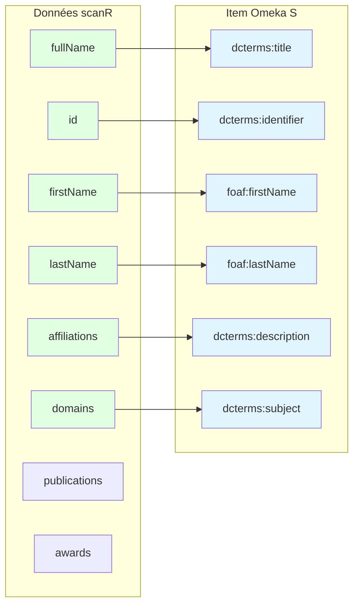

# Omeka-S-module-Scanr

Module Omeka S pour interroger l'API Elasticsearch de scanR et enregistrer les informations liées aux personnes.

## Description

Ce module permet d'interroger l'API scanR du Ministère de l'Enseignement Supérieur et de la Recherche française pour rechercher et importer des informations sur des personnes (chercheurs, enseignants-chercheurs, etc.) directement dans Omeka S.

scanR est une plateforme qui recense les acteurs de la recherche et de l'innovation en France, incluant des informations sur les chercheurs, leurs affiliations, domaines de recherche, publications et distinctions.

## Architecture

### Composants du module

### Flux de travail

## Fonctionnalités

- **Recherche de personnes** : Recherche par nom, prénom, affiliation ou domaine de recherche
- **Affichage des résultats** : Visualisation des informations principales (nom, affiliations, domaines)
- **Import dans Omeka S** : Création automatique d'items avec les métadonnées des personnes
- **Configuration flexible** : URL de l'API configurable

## Installation

1. Téléchargez ou clonez ce module dans le répertoire `modules` de votre installation Omeka S
2. Renommez le dossier en `Scanr` si nécessaire
3. Avec un terminal, dans le repertoire `Scanr`, exécuter : composer install --no-dev
4. Dans l'interface d'administration d'Omeka S, allez dans Modules
5. Trouvez "Scanr" dans la liste et cliquez sur "Installer"

## Configuration

Après l'installation, vous pouvez configurer le module :

1. Cliquez sur "Configurer" à côté du module Scanr
2. Modifiez l'URL de l'API si nécessaire (par défaut : `https://scanr-api.enseignementsup-recherche.gouv.fr`)
3. Enregistrez les modifications

## Utilisation

### Rechercher des personnes

1. Dans le menu d'administration, cliquez sur "Scanr"
2. Cliquez sur "Rechercher des personnes"
3. Entrez un nom, prénom, ou affiliation dans le champ de recherche
4. Cliquez sur "Rechercher"

### Importer une personne

1. Après avoir effectué une recherche, parcourez les résultats
2. Cliquez sur le bouton "Importer" à côté de la personne souhaitée
3. La personne sera créée comme un nouvel item dans Omeka S avec les métadonnées suivantes :
   - Titre (nom complet)
   - Prénom (foaf:firstName)
   - Nom (foaf:lastName)
   - Identifiant scanR (dcterms:identifier)
   - Domaines de recherche (dcterms:subject)
   - Affiliations (dcterms:description)

## Structure des données

Les données importées depuis scanR incluent :

- **Informations personnelles** : Prénom, nom, nom complet
- **Identifiant unique** : ID scanR
- **Affiliations** : Structures de rattachement (universités, laboratoires, etc.)
- **Domaines de recherche** : Thématiques scientifiques
- **Publications** : Liste des publications (si disponible)
- **Distinctions** : Prix et récompenses (si disponible)

### Mapping des métadonnées

## API scanR

Ce module utilise l'API Elasticsearch publique de scanR. Pour plus d'informations sur scanR :
- Site web : https://scanr.enseignementsup-recherche.gouv.fr
- Documentation API : https://scanr-api.enseignementsup-recherche.gouv.fr

## Exigences

- Omeka S 3.0 ou supérieur
- PHP 7.4 ou supérieur
- Extension PHP cURL activée

## Auteur

Samuel Szoniecky

## Licence

GPL-3.0

## Support

Pour signaler des bugs ou demander des fonctionnalités, veuillez utiliser le système d'issues de GitHub : https://github.com/samszo/Omeka-S-module-Scanr/issues